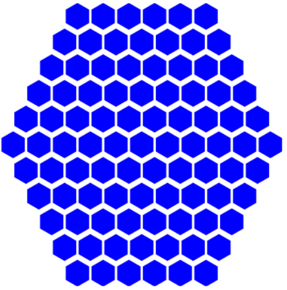

# Honeycomb Layout Display

## Overview
This Python script generates mesmerizing honeycomb patterns using the Matplotlib library. Honeycomb patterns, reminiscent of those found in beehives, are formed by arranging hexagons in rows. This script allows you to customize the number of rows and the arrangement of hexagons within each row, enabling you to create diverse honeycomb designs.

## Features
- Easily customizable honeycomb patterns
- Adjustable number of rows
- Flexible arrangement of hexagons within each row
- Beautiful visualizations with Matplotlib

## Usage
1. Clone the repository:
git clone https://github.com/rafvrab/honeycomb_layout_display.git

2. Navigate to the project directory:
cd honeycomb_layout_display

3. Run the script:
python honeycomb_layout_display.py

## Example

## Dependencies
- Python 3.x
- Matplotlib

## Contributing
Contributions are welcome! If you have any ideas for improvement or new features, feel free to submit a pull request.

## License
This project is licensed under the MIT License - see the [LICENSE](LICENSE) file for details.
